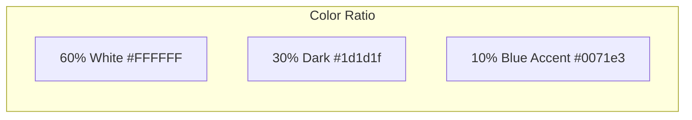
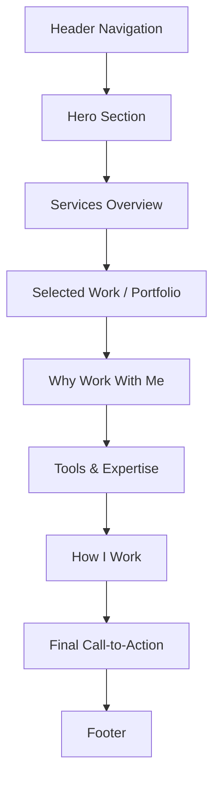
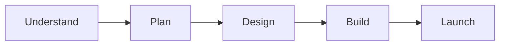

# Muhammad Basam Premium Portfolio Homepage

# Muhammad Basam — Premium Portfolio Homepage

A clean, spacious, Apple-inspired personal portfolio that positions you as a **Website Designer, Graphic Designer & Digital Marketing Professional**.

---

## Visual Direction

- **Predominantly white** with generous breathing room
- **Dark charcoal** (#1d1d1f) for headlines and select sections
- **Electric blue** (#0071e3) reserved only for CTAs and key interactive elements
- **No shadows**, no glassmorphism, no decorative blobs
- Alternating white / light gray (#f5f5f7) section backgrounds for rhythm
- 28px rounded corners on cards, pill-shaped buttons

---

## Homepage Structure

---

## Section Details

### 1. Header / Navigation
A lightweight, spacious navigation bar:
- **Logo:** "Muhammad Basam" in clean typography
- **Links:** Home, About, Services, Portfolio, Pricing, Contact
- **CTA Button:** "Let's Work Together" (blue pill button)
- Sticky on scroll with subtle backdrop blur
- Mobile: Clean hamburger menu

---

### 2. Hero Section (Primary Focus)

This is the highest-impact section featuring your portrait and floating tech icons.

**Layout:**
- Your professional portrait positioned prominently (right side on desktop)
- Large headline on the left
- Floating technology logos (WordPress, Elementor, WooCommerce, Photoshop, Illustrator, Meta, Facebook) arranged organically around the composition
- Soft pastel gradient background (will create a subtle blue-to-white gradient since no background was uploaded)

**Content:**
- **Headline:** "I Build Modern Websites, Create Stunning Designs & Run Meta Ads That Get Results"
- **Subtext:** Brief positioning as Website Designer, Graphic Designer & Digital Marketing Professional with 4+ years experience
- **CTAs:** "View My Work" (primary blue) + "Let's Work Together" (outline)

**Mobile:** Portrait moves above text, icons scale and reposition intelligently

---

### 3. Services Overview
Three main service categories presented in clean cards:

| Service | Description |
|---------|-------------|
| **Website Design** | WordPress, WooCommerce, business sites, e-commerce, landing pages, redesigns |
| **Graphic Design** | Social media posts, ad creatives, marketing materials, branding |
| **Digital Marketing** | Meta Ads, Google Ads, campaign planning, performance analysis |

Each card links to future dedicated service pages.

---

### 4. Selected Work / Portfolio
A curated showcase of your best projects:
- Large project thumbnails with hover reveal
- Project name + category + brief description
- "View All Work" link to future portfolio page
- Clean grid layout (2-3 columns on desktop)

*Note: Will structure this to accept real project images when you provide them*

---

### 5. Why Work With Me
Your professional value proposition:
- Multidisciplinary approach (design + websites + marketing)
- 4+ years practical experience
- Business-focused thinking, not just decoration
- Understanding of user experience and conversion

Presented as a clean text section with optional supporting visual.

---

### 6. Tools & Expertise
Visual display of your tech stack:
- WordPress, WooCommerce, Elementor
- Canva Pro, Photoshop, Illustrator
- Meta Ads, Google Ads
- Clean icon/logo grid, minimal and professional

---

### 7. How I Work (Process)
Simple 4-5 step visual process:

Each step with a one-line description. Clean, minimal, not over-designed.

---

### 8. Final CTA Section
Strong closing invitation:
- **Headline:** "Have a Project in Mind?"
- **Subtext:** Short encouraging line
- **Button:** "Let's Work Together"
- Dark background (#1d1d1f) with white text for contrast

---

### 9. Footer
Clean, organized footer:
- Name + short professional tagline
- Quick navigation links
- Service links
- Contact information
- Social links (placeholders for now)
- Copyright + future policy page links (Disclaimer, Privacy, Terms)

---

## Typography

| Element | Style |
|---------|-------|
| Hero Headline | 56-80px, weight 600-700, tight tracking |
| Section Headings | 40px, weight 600 |
| Body Text | 17px, weight 400 |
| Buttons | 17px, weight 400 |

Using Inter as the web-safe substitute for SF Pro.

---

## Responsive Behavior

- **Desktop:** Full composition with portrait right, text left in hero
- **Tablet:** Adjusted spacing, maintained hierarchy
- **Mobile:** Stacked layout, portrait above text, icons repositioned, readable typography

---

## Technical Foundation

The build will establish reusable components and design tokens that can extend to future pages:
- Consistent button styles
- Section container patterns
- Card components
- Typography scale
- Spacing system
- Navigation component
- Footer component

---

## What's Included in This Phase

- Complete homepage with all 9 sections
- Responsive design for all screen sizes
- SEO-optimized structure (proper headings, meta tags, semantic HTML)
- Your actual professional content (no fabricated claims)
- Your portrait photo integrated
- Tech logos as floating icons
- Reusable component architecture for future pages

---

## What's NOT Included (Future Phases)

- About page
- Individual service pages
- Portfolio page with full project details
- Pricing page
- Contact page with form
- Legal pages (Disclaimer, Privacy, Terms)

---

## Notes

- Since no hero background image was uploaded, I'll create a subtle, elegant gradient that fits the Apple-inspired aesthetic
- Project thumbnails in the portfolio section will use placeholder structure — ready for your real project images
- All content uses your actual professional information, no fabricated statistics or testimonials

